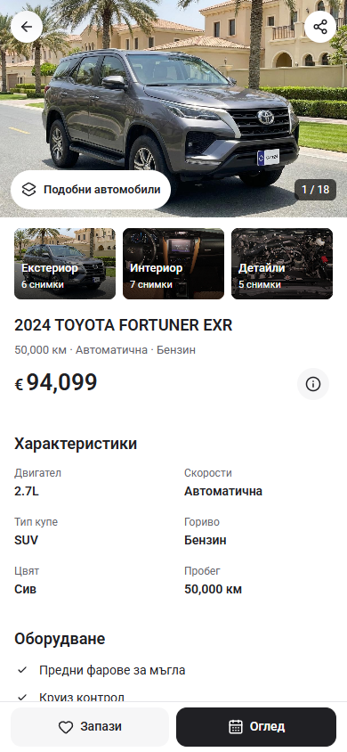
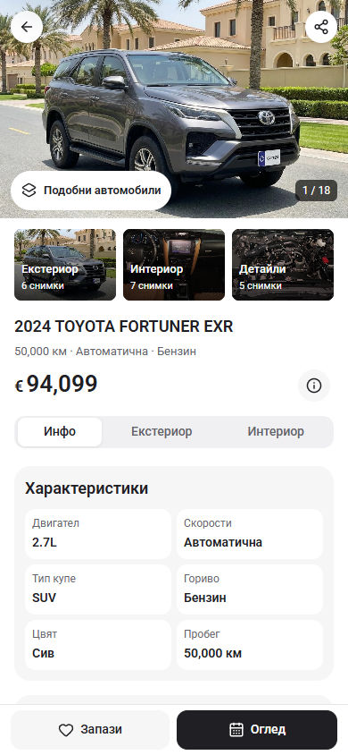
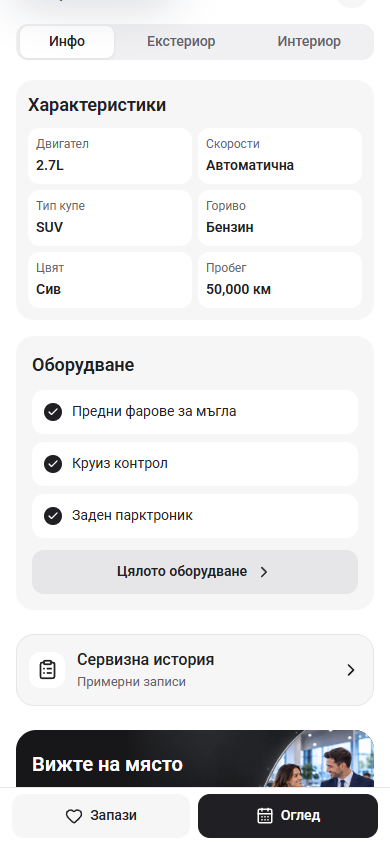

# PDP segments and grouped information — 2 October 2026

The three Exterior / Interior / Details thumbnail albums remain below the main photo. The Info / Exterior / Interior segmented control is restored below the price, using the previous tab component and its existing keyboard behavior. Info shows the specifications, equipment and service-history entry; the photo tabs show the matching listing photos and open the existing viewer at the selected image.

Specifications and equipment use their original rounded containers, white fact/feature rows and full-width equipment action again. The fact grid retains the adaptive one-column layout for enlarged text. Home and its artwork remain unchanged.

## Before and after at 390 × 844

| Before | After |
| --- | --- |
|  |  |
|  |  |

The before images are the previous task's final captures. Their checked source hashes matched the untouched pre-edit files in this task. The after captures use the same Bulgarian route, viewport and Overview scroll offset.

## Verification

Browser checks cover BG/EN PDP at 320, 390 and 1440 pixels, plus 320 × 480 with doubled text. They check document overflow, visible images, fixed-action spacing and enlarged facts. Interactions cover Info/photo tab switching, keyboard selection, category images/counts, viewer focus return, Details albums and browser Back, sample service history and an empty category on a single-photo car. See [browser results](browser-check.json).

The Cars24 reference and unrelated work remain preserved. This is a local template correction; owner visual acceptance remains a separate decision.

`npm run check` passes ESLint, TypeScript and the production build with Node 22.20.0; 407 pages generated. The build uses a separate output directory and preserves the existing Next-generated configuration. Final checked source hashes are saved in [check-result.json](check-result.json). The enlarged Bulgarian heading also wraps within its container.
