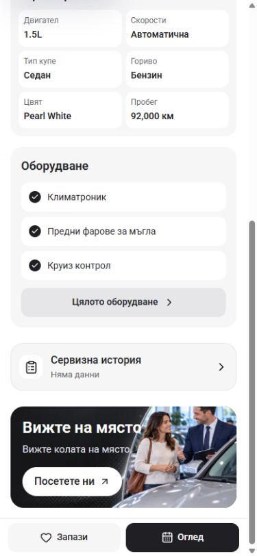
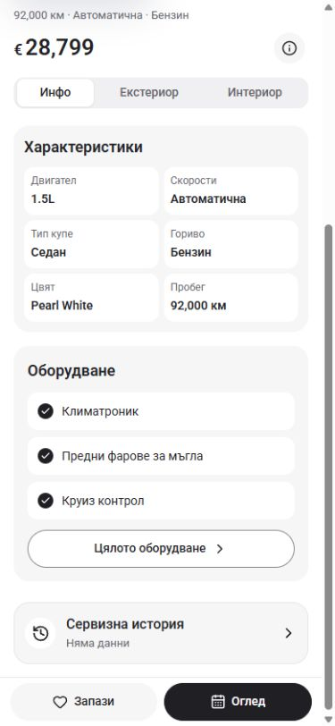
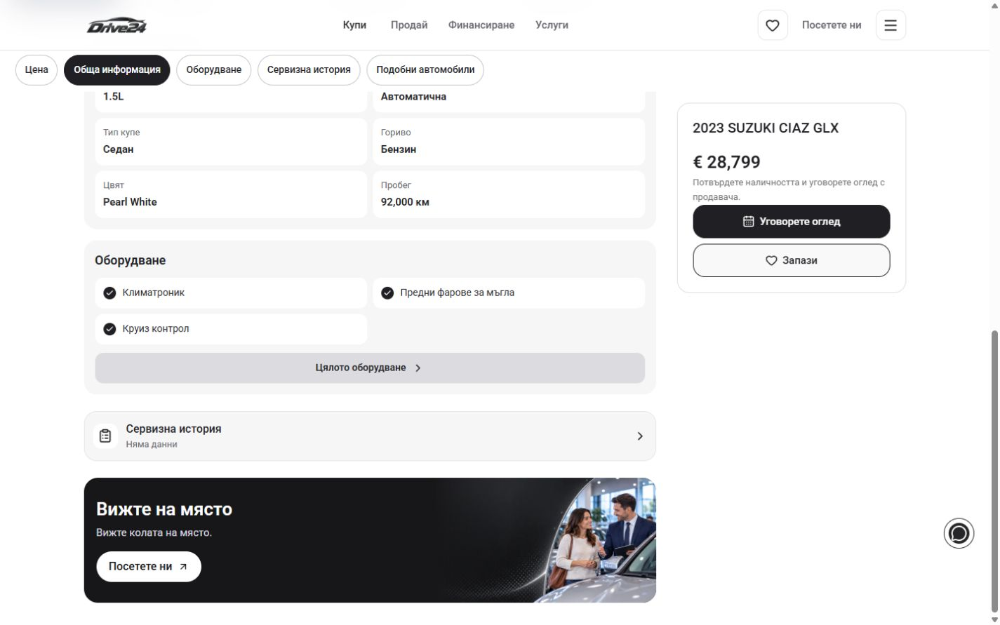
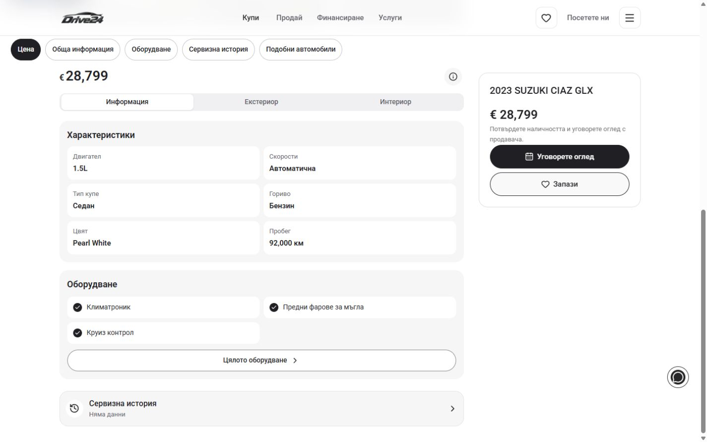

# PDP controls and compact layout — 4 October 2026

The owner asked about the equipment button's color and rounding, the service-history icon, and the overlap between the visit banner and the persistent Viewing action.

The PDP now uses pill corners for equipment, Save, Viewing and the records drawer's request action, through `radiusPill`. Viewing stays black. Equipment and document requests use white outlined buttons. The service-history row keeps 18px card corners and a circular icon tile. It uses a checkmarked document when supplied records are present; empty and explicitly labelled sample history use a neutral history icon. The document icon signals records being present, not independent verification.

The extra visit banner is removed. Viewing remains available in the phone footer and desktop sidebar, with the existing showroom and request options. Service history remains a compact row with its records drawer. Artwork and source components are preserved. This follows the recommended compact layout shared with the owner during this turn; no alternate layout was selected before implementation finished.

## Before and after

Captures use the same Bulgarian Suzuki PDP, viewport dimensions and end-of-page scroll state. The shorter page shows more vehicle information above the controls after the banner removal. Native scrollbar space is included in the requested viewport width.

| Viewport | Before | After |
| --- | --- | --- |
| 390 × 844 |  |  |
| 1440 × 900 |  |  |

## Verification

- `npm run check` passed on Node 22.20.0: ESLint, TypeScript and the webpack production build. `.next-build-check` kept build output separate from the active development server; `next-env.d.ts` was preserved.
- The local Bulgarian Suzuki PDP passed at 320, 390, 768 and 1440px. English passed at 320, 390 and 1440px.
- All inspected sizes showed pill equipment/Save/Viewing actions at least 44px high, the 18px history card, no horizontal overflow, and no visit or ownership promotions.
- Each inspected size retained six specifications, three equipment preview items and three gallery album buttons. The current car's status remained No records with a neutral history icon.
- Keyboard Tab reached the equipment link with a visible 2px outline; Enter opened the full equipment page. Its Back link returned to the same PDP.
- Service history opened the correct empty state. Its 48px outlined pill opened a draft asking for this car's service documents. Escape dismissed the draft. No message was copied or sent.
- Viewing opened its options, including the `/bg/stores` link. Escape dismissed the options and restored focus to Viewing.
- No browser console errors were reported during these checks. The supplied-record icon branch is source-reviewed; the current configured demo car has no supplied records.

Measurements and interaction results are in [before-geometry.json](before-geometry.json) and [verification.json](verification.json). Additional after captures cover Bulgarian 320, English 320/390/1440 and the history drawer. This verifies local source and behavior; dealer publishing and release selection are separate.
