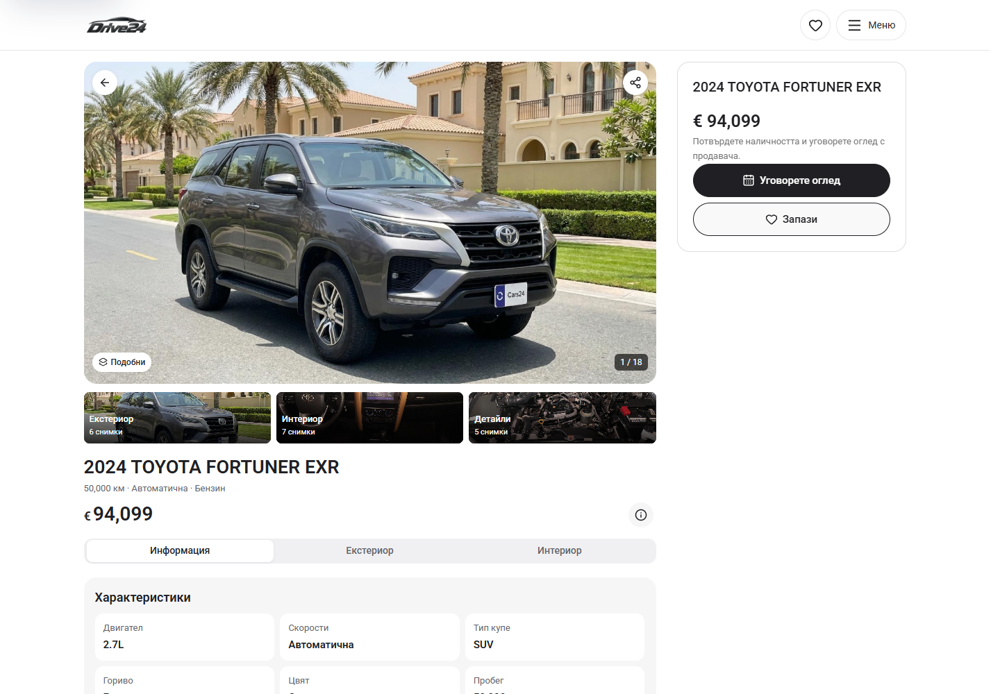
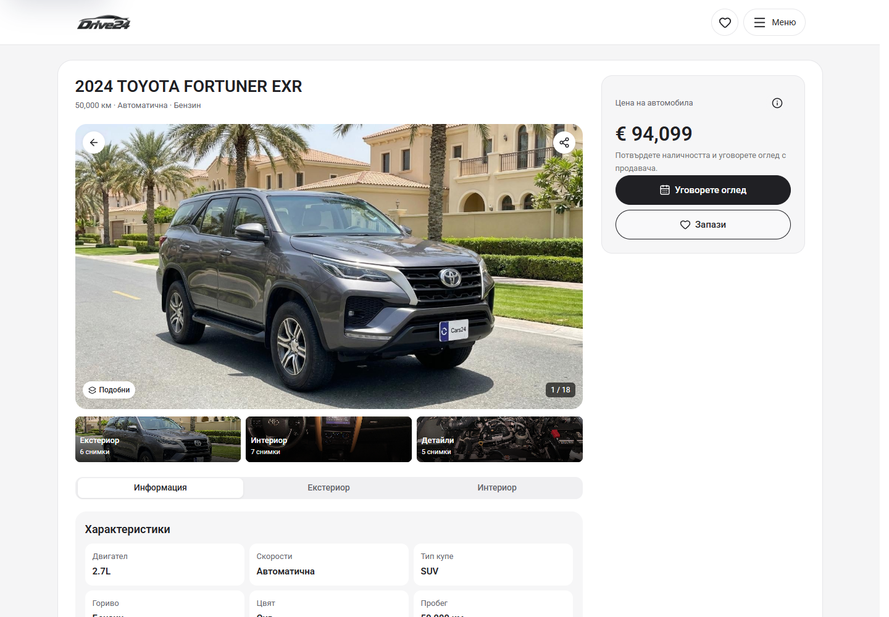

# Desktop PDP shell preview — 5 October 2026

Local comparison requested by the owner. This candidate adds a pale grey canvas and a bounded white surface around the existing desktop PDP, moves its single vehicle heading above the gallery and keeps the single price with the Viewing, Save and price-information controls on the right. The white dealer header, photographs, albums, information tabs, records and enquiry drafts retain their existing behavior. The change starts at 1100px.

Preview: `http://127.0.0.1:6483/bg/cars/2024-toyota-fortuner-exr`. This is source/local preview evidence, pending owner visual acceptance; no dealer deployment or release-lock update is included.

At this closeout, the existing Cars root `.git/index.lock` prevents the scoped commit/push. The lock is preserved and the candidate remains in the existing main checkout.

## Matched desktop screenshots

The same vehicle, locale, viewport, scroll target and dismissed welcome state are used for each pair. Before captures are from source HEAD `eb4ed2a45` before this shell change. After captures use the candidate implementation.

| View | Before | After |
| --- | --- | --- |
| BG, 1440 × 1000, top | [Before](pdp-1440-before.png) | [After](pdp-1440-after.png) |
| BG, 1440 × 1000, details | [Before](pdp-details-1440-before.png) | [After](pdp-details-1440-after.png) |
| EN, 1280 × 1000, top | [Before](pdp-en-1280-before.png) | [After](pdp-en-1280-after.png) |

## Verification

- `npm run check` passed using Node 22.20.0 and isolated `.next-build-check`: ESLint, TypeScript and production build completed, including 407/407 generated pages. [Build receipt](check.txt).
- [19 focused checks](verification.json) passed: BG/EN at 1100, 1280, 1440 and 1920px; shell bounds, heading/gallery hierarchy, one visible price/title, sticky actions and Price navigation; skip-link focus, photo albums/keyboard/zoom, information tabs, price information, service records, viewing draft, Saved, equipment search, full gallery, filtered Back and menu/Home navigation. No browser errors were recorded.
- [Six phone/tablet comparisons](preservation.json) at 320, 390 and 1099px passed at the top and details scroll targets. Visible element geometry and text match the baseline. Pixel differences outside the reference photograph boxes are zero above a one-channel tolerance; the photo boxes are excluded because captured browser image decoding varies. Both 1099px screenshots match pixel for pixel.
- All 18 captures have no document overflow, visible broken images or browser errors. Raw measured captures are in [before-capture.json](before-capture.json) and [after-capture.json](after-capture.json).

The generated `next-env.d.ts` was restored to its exact pre-build contents. No phone/tablet styles, inventory fixtures, identity assets, publishing tools or approved release selection were changed.
