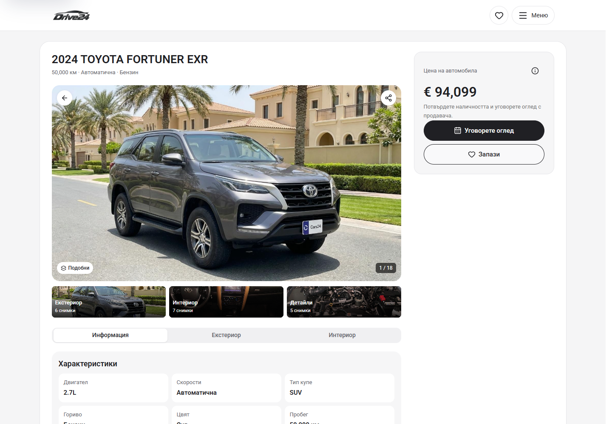
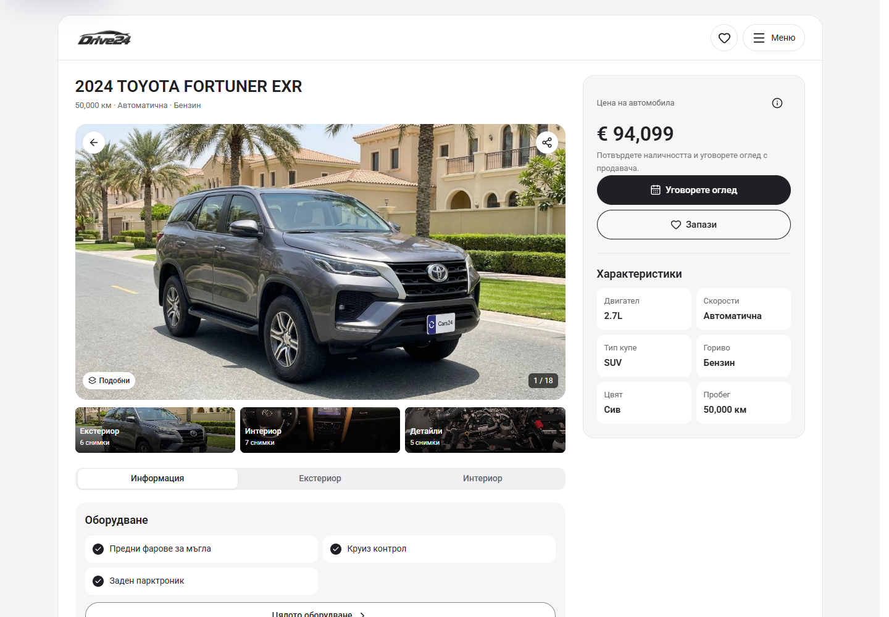

# Desktop PDP shell correction — 5 October 2026

The owner corrected the separate PDP frame: the dealer header belongs inside the same shell, and the right column should carry useful vehicle information. From 1100px, AppShell now contains the white header and vehicle detail pages in one continuous white surface. The PDP's separate inner border is removed. Its right panel contains one price, the existing Viewing/Save/price-information buttons and the existing specifications in two columns. The main column retains the heading, photographs, albums, information/photo tabs, equipment and service-history controls. Specifications are shown once on desktop and retain their original presentation below the gallery on narrower screens.

The right panel fits the available viewport height and scrolls only when needed, with every fact reachable. Price navigation resets the panel to its price/actions. Gallery and equipment pages share the enclosing header frame. Desktop Home and Cars remain unchanged.

Preview: `http://127.0.0.1:6483/bg/cars/2024-toyota-fortuner-exr`. This is local source/preview evidence, pending owner visual acceptance. No dealer deployment or approved release selection is changed. The existing Cars root `.git/index.lock` is preserved; scoped commit/push remains pending while the index is locked.

## Matched screenshots

Before is the separate-shell local candidate immediately before this correction, based on Cars HEAD `4a60675574ec1d312c82df8d6caed3cd954a12e8` plus its uncommitted PDP changes. After is the corrected local candidate. Both use the same route, locale, viewport, scroll target, reduced-motion setting and dismissed welcome state.

| View | Before | After |
| --- | --- | --- |
| BG, 1440 × 1000, top | [Before](pdp-1440-before.png) | [After](pdp-1440-after.png) |
| BG, 1440 × 1000, details | [Before](pdp-details-1440-before.png) | [After](pdp-details-1440-after.png) |
| EN, 1280 × 1000, top | [Before](pdp-en-1280-before.png) | [After](pdp-en-1280-after.png) |
| BG, equipment, 1440 × 1000 | [Before](features-1440-before.png) | [After](features-1440-after.png) |
| BG, gallery, 1440 × 1000 | [Before](gallery-1440-before.png) | [After](gallery-1440-after.png) |

## Verification

- `npm run check` passed using Node 22.20.0 and isolated `.next-build-check`: ESLint, TypeScript and production build completed, including 407/407 generated pages. [Build receipt](check.txt).
- [19 focused checks](verification.json): BG/EN at 1100, 1280, 1440 and 1920px, shared header/frame alignment, title/gallery hierarchy, one visible price/title/specification set, sidebar fact placement, short-screen scrolling/sticky bounds and Price navigation; skip-link focus, albums/keyboard/zoom, information tabs, price information, service records, viewing draft, Saved, equipment search, full gallery, filtered Back and menu/Home navigation. No browser errors.
- [Eight preservation comparisons](preservation.json): phone/tablet PDP top and details at 320, 390 and 1099px, plus desktop Home and Cars at 1440px. Visible element geometry/text matches. Pixel differences outside the reference photograph boxes are zero above a one-channel tolerance; photo boxes are excluded because browser image decoding varies. Home and both 1099px views match pixel for pixel.
- All 26 screenshots have no document overflow, visible broken images or browser errors. See [before-capture.json](before-capture.json) and [after-capture.json](after-capture.json).

No identity assets, inventory fixtures, phone/tablet controls or publishing files were changed. Generated `next-env.d.ts` is restored after the check. Existing photographs and truthful records/enquiry behavior are retained.
