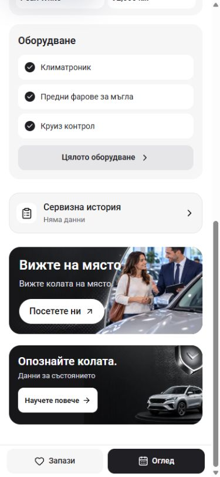
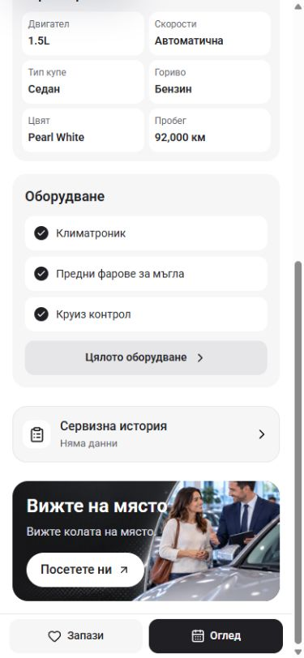
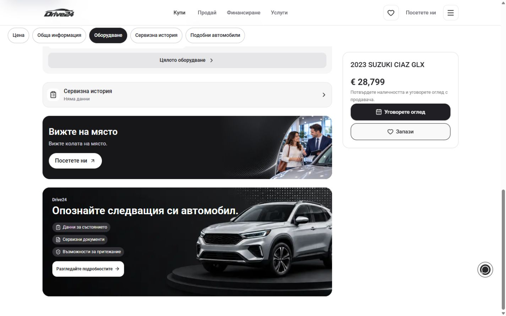

# PDP single banner — 4 October 2026

This intermediate composition is superseded by the later [PDP controls and compact layout](../pdp-controls-2026-10-04/README.md). The final PDP keeps the persistent Viewing action and compact service-history row, with no extra visit promotion. These captures preserve the earlier two-banner to one-banner step.

The owner noticed inconsistent button rounding between the two PDP promotions and asked whether one banner would be enough. The PDP now keeps only the showroom visit banner below the vehicle details. Its existing white action has 30px pill corners and a 44px height. The removed compact buying-guidance action had 10px corners on phones and 13px on wider screens.

The change removes the compact `OwnershipPanel` import and mount from `VehicleBelowFold`. The original artwork and component remain available on the benefits page. Specifications, equipment, service history, gallery and the viewing enquiry action are preserved.

## Before and after

The captures use the same Suzuki PDP, Bulgarian locale, viewport dimensions and end-of-page scroll state. Removing the second promotion shortens the page, so more vehicle details appear above the remaining banner in the after captures. The browser's native scrollbar occupies part of the requested viewport width.

| Viewport | Before | After |
| --- | --- | --- |
| 390 × 844 |  |  |
| 1440 × 900 |  |  |

## Verification

- `npm run check` passed with Node 22.20.0: ESLint, TypeScript and the webpack production build. Build output used `.next-build-check`; the active development output and `next-env.d.ts` were preserved.
- Local Bulgarian PDP checks passed at 320, 390, 768 and 1440px. English checks passed at 320, 390 and 1440px.
- Every inspected size rendered one visit banner, no ownership promotion, loaded artwork and no horizontal overflow. The remaining white action stayed 44px high with 30px corners; the viewing action stayed at least 44px high.
- Every inspected locale and size retained six specification values, three equipment preview items, service history and three gallery album buttons.
- Keyboard Tab reached the visit banner with a visible 2px outline. Enter opened `/bg/stores`; Back returned to the same PDP. The viewing action opened its options dialog; Escape dismissed it and restored focus to the trigger.
- The browser reported no console errors during these checks. No enquiry was submitted.

Raw measurements are in [before-geometry.json](before-geometry.json) and [verification.json](verification.json). Additional after captures cover Bulgarian 320/768 and English 320/390/1440. This verifies the local master; template release selection and dealer deployment are separate.

## Earlier integration hold

The earlier step could not be committed while `L:/CODEX/cars/.git/index.lock` was present. The lock was preserved. That step is included in the final source changes documented in the linked controls receipt, rather than integrated as a separate intermediate composition.
