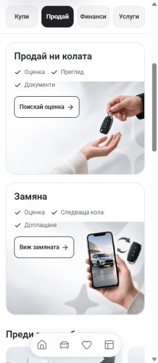

# Sell banner continuity — 2 October 2026

The owner’s screenshot exposed a defect missed in the preceding review: the 270px mobile card contained a wide photo at the bottom, leaving a solid white strip above it. Keeping the copy inside the outer border did not make the composition continuous.

Mobile Sell cards now follow the existing artwork’s 3:2 proportions, with a 196px content minimum. The proportional photo covers the complete mobile frame without a mask. At 320/324px the cards are 196px tall; at 390px they are 234px tall. The two-row checklist occupies the clear left area. The exchange label is shortened to **Избор**, and English uses **Check** and **View exchange** to avoid a third checklist row or an oversized action. Desktop retains its full labels and proportional contained photo. Original artwork files are unchanged.

The retained local Cars24 Sell page was inspected on desktop and at a confirmed 324px viewport. Its cards keep the photo and information in one continuous frame. See the [mobile reference capture](cars24-reference-mobile.jpg). Marketplace claims and identity were not copied into the App.

| Nominal 324px viewport | Before | After |
| --- | --- | --- |
| Sell banners |  |  |

These are real browser captures. The browser scrollbar leaves 309px of CSS content width at a 324px viewport. The final image was captured from the visible app tab after testing both actions. Earlier intermediate captures remain in the ignored task runtime directory.

[Browser results](visual-checks.json) record BG/EN at actual 320, 390, 768 and 1440px widths, plus BG at 324px. Requested widths were checked against `innerWidth`. Text and actions stay inside the frames, the images load, and no page overflow was found. Both phone checklists use two rows. Desktop captures were separately checked with the complete cards visible. The visible 324px result was checked again after navigation.

Both Sell actions open the existing `/bg/sell/details` draft form, and Back restores Sell. No enquiry was submitted. No browser console errors were recorded. Temporary viewport overrides were reset after inspection.

`npm run check` passed with Node 22.20.0: ESLint, TypeScript and the production build, generating 407 pages. The build used `.next-sell-banner-continuity-20261002`, separately from the running dev server, and restored generated TypeScript configuration. [Build results](check-result.json) record the four source hashes; the files remained unchanged during the check and matched again before staging.

Additional captures: [BG 320px](bg-sell-after-320.jpg), [BG 390px](bg-sell-after-390.jpg), [BG desktop](bg-sell-after-1440.jpg), [EN 320px](en-sell-after-320.jpg), [EN 390px](en-sell-after-390.jpg), [EN desktop](en-sell-after-1440.jpg).

Review the [local Sell preview](http://127.0.0.1:6483/bg/sell). These checks establish local browser behavior and a successful build; owner visual acceptance remains open. No dealer refresh or deployment was performed.
