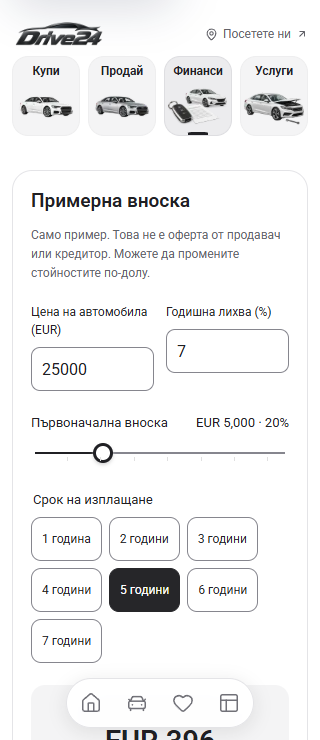
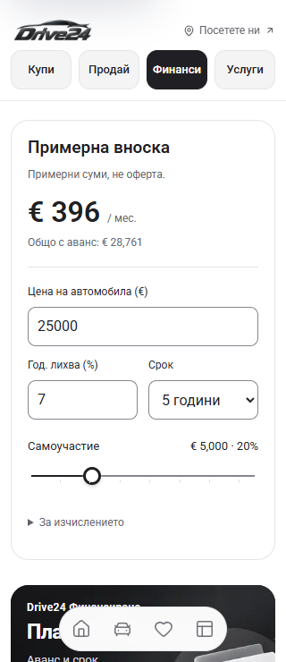

# Sell, Finance and Services mobile polish

The narrow layouts squeezed translated copy into small image-side columns. Sell's checkmarks and exchange button wrapped unnecessarily, the finance term choices occupied three rows, and the budget banner clipped its button. The revised mobile copy fits the available width; detailed information remains available in the service and calculation disclosures.

## Changes

- Sell: full-width compact checkmarks wrap into one or two rows, a shorter exchange heading and actions, and a clear text area above the retained artwork.
- Finance: one light calculator with the monthly estimate first, editable price and interest fields, a compact selector retaining all seven repayment terms, euro symbols, and a disclosure for the full calculation notes. The existing amortisation formula is unchanged.
- Budget and care campaigns: shorter mobile titles, descriptions and actions; content can increase the banner height instead of clipping.
- Services: short mobile package labels and checkmarks, content-sized headers, and full Bulgarian descriptions in the details sheets.
- Enlarged text: process cards reflow long words, manufacturer columns grow with text size, and the finance control pair becomes a single column when needed.

The local Cars24 calculator at `http://127.0.0.1:6484/finance` supplied the estimate-first hierarchy and editable numeric-field behaviour. Its UAE salary eligibility formula and approval claims were not introduced. Original dealer artwork and the desktop's detailed marketing copy are retained.

## Before / after at 320px

Each frame is an actual browser screenshot. The affected section is positioned below its sticky navigation. The earlier frames retain the navigation state captured before editing; the final frames wait for client hydration and the compact scrolled header.

| View | Before | After |
| --- | --- | --- |
| Sell methods |  |  |
| Calculator |  |  |
| Budget banner |  |  |
| Service packages |  |  |

[Cars24 reference](cars24-finance-reference-320.png), [390px Sell](sell-methods-after-390.png), [390px Finance](finance-calculator-after-390.png), [390px Services](service-options-after-390.png).

## Verification

`npm run check` passed on Node 22.20.0: ESLint, TypeScript and the webpack production build. The build used an isolated output directory; the source hash report recorded no changes during the check. See [build result](check-result.json).

The local Chrome checks covered 21 layouts: Bulgarian and English Sell/Finance/Services at 320px, 390px and 1440px, plus Bulgarian 320px with doubled text. The affected sections had no document horizontal overflow or clipped text, normal mobile checkmarks used at most two rows, and campaign actions stayed inside their banners. See [browser results](verification.json).

Finance checks exercised clearing/retyping inputs, live estimates, zero interest, all seven terms, keyboard adjustment of the deposit, decimal rates, bounds on blur and the calculation disclosure. Both service detail sheets retained their full translated content and restored focus on closing. Finance enquiries opened and closed with focus restored; Sell/Service make selection and browser Back worked. The shared calculator also fit and responded inside the PDP payment sheet at 320px. No message was sent and no booking was submitted.

These are local browser and production compilation results. Physical-device rendering, hosted deployment and lender integration were not part of this change.
