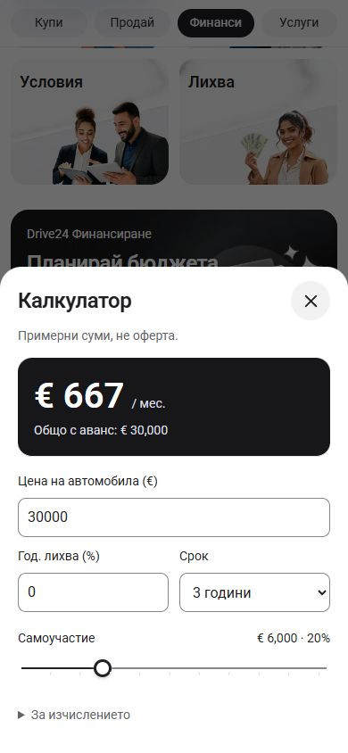

# Typography, service tabs and calculator placement

Verified locally on 2 October 2026 at `http://127.0.0.1:6483`.

The budget campaign now precedes a single 44px Calculator button. Its previous dark card, description and nested action are removed. The existing calculator sheet keeps its values, keyboard boundary and history behavior.

`app/typography.stylex.ts` supplies shared text roles to the Home promotions, landing banners, Sell methods, service packages and instructions, Finance benefits and calculator. Bulgarian uses Roboto; English uses Geist for headings, copy and controls. The legacy display-family token now selects the same family as normal text.

The mobile service header is 88px initially and 52px when scrolled, previously 104px and 68px. Scrolled pills are 32px tall inside 44px link targets, with regular 14px labels. All four labels remain on one line at 320px. Home promotions follow their content height so tablet copy and buttons remain visible.

## Validation

- `npm run check` passed under Node 22.20.0: ESLint, TypeScript and the webpack production build. `.next-build-check` isolated the build from the running dev server; generated route declarations were restored to their dev paths afterward.
- Buy, Sell, Finance and Services rendered at 320px, 390px and 1440px. Home and Finance also rendered at 768px; English Finance rendered at 320px and 390px. The 17 records in [verification.json](verification.json) show no page overflow or clipped promotion buttons.
- The calculator updated from a default estimate of EUR 396 to EUR 667 for a EUR 30,000 price, 20% deposit, zero interest and a three-year term. Closing and reopening preserved those values.
- Shift+Tab wrapped from Close to the estimate disclosure. Escape closed the sheet and restored launcher focus and body scrolling. Back closed it without leaving `/bg/finance`. Background content was isolated while open.
- The desktop calculator was centered at 560px width; the 320px phone sheet stayed within the viewport with 16px inputs.

The screenshots are local rendered evidence. Dealer refresh, deployment and owner acceptance are separate steps.

