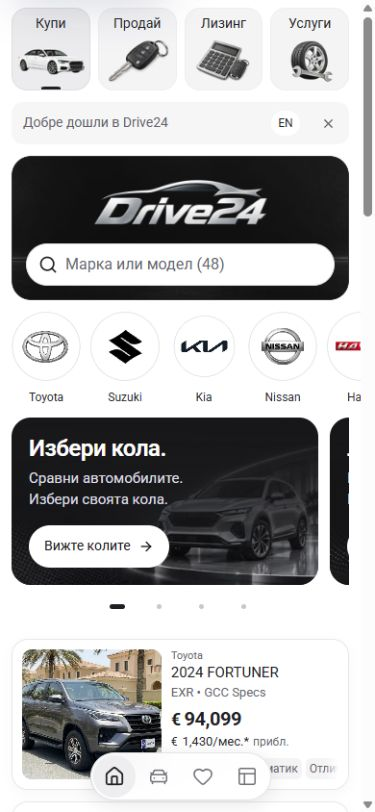
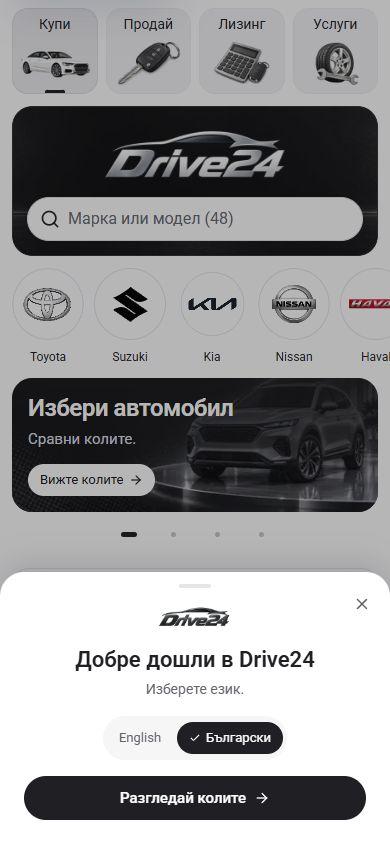
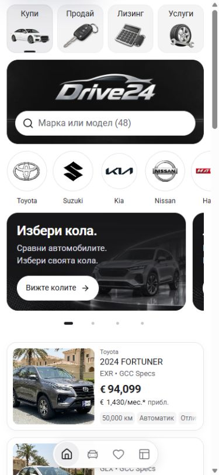
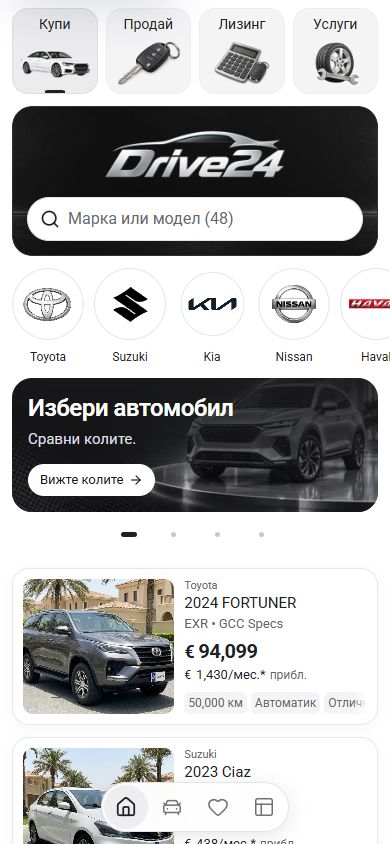

# Bottom welcome sheet and compact Home promotions — 4 October 2026

The welcome opens over Home from the bottom, through a body portal. It adds no row to the page. The phone sheet meets the viewport edges with rounded top corners; wider screens use a centered 440px panel with a 24px bottom gap. The configured dealer logo, native language choices and localized stock action remain together. Dismissal is remembered per dealer and mount; `?welcome=1` explicitly reopens the review. Close, Escape and the backdrop dismiss it. The shared modal handles focus, background isolation and scroll restoration without a history entry. Transform and opacity entrance animations respect reduced motion.

The root retains a stable scrollbar gutter on wider screens, preventing page-width changes while the modal locks scrolling. Phone chrome hides the native vertical scrollbar so the sheet and backdrop do not leave an empty edge. Normal vertical scrolling remains available when the sheet closes.

All four promotions beneath the make strip use one title, one supporting line and a compact 32px visual action. The first Bulgarian title is **Избери автомобил**. Text uses the full inner width; short localized copy fits at 320px without clipping or shrinking. Phone cards align to both page gutters and measure 134px high; wider two-column cards measure 158px. The 44px search stays larger than the visual CTA. Each complete card remains one link, with an inset keyboard outline, retained artwork and its existing destination. Pagination retains 44px targets.

| Matched view | Before | After |
| --- | --- | --- |
| Bulgarian welcome, 390 × 844, scroll 0 |  |  |
| Bulgarian Home, 390 × 844, scroll 0 |  |  |
| Bulgarian Home, 320 × 844, scroll 0 | [Before](bg-320-home-before.jpg) | [After](bg-320-home-after.jpg) |

Further captures: [Bulgarian 320px sheet](bg-320-welcome-after.jpg), [desktop sheet](bg-1440-welcome-after.jpg), [desktop cards](bg-1440-home-after.jpg), [English sheet](en-390-welcome-after.jpg), [English Home](en-390-home-after.jpg) and [320px Sell promotion](bg-320-sell-promotion-after.jpg). [Open the Bulgarian review](http://127.0.0.1:6483/bg?welcome=1).

Focused layout checks passed at BG 320/390/768/1440px and EN 320/390/1440px. Every promotion title and subtitle fit one line; CTAs measured 32px against 44px search, and no card had a nested button or link. Opening and closing the welcome preserved the measured header, dealer panel, search and promotion rectangles and page scroll position in all seven cases. Welcome controls retained 44px targets, configured logos loaded, and the background was isolated. Desktop root `clientWidth` changes when the native scrollbar is hidden; measured page geometry stays equal because its gutter remains reserved.

Keyboard checks confirmed Tab/Shift+Tab containment, Escape dismissal and scroll/background restoration. Language selection retained the review flag on the localized Home route. The stock action reached `/bg/cars`, promotion keyboard activation reached `/bg/sell`, and the third pager aligned to its card. A settled return visit retained dismissal. The prior [inline](../welcome-inline-2026-10-04/README.md), [floating banner](../welcome-banner-2026-10-04/README.md) and [sheet](../welcome-sheet-2026-10-04/README.md) trials remain as history. Detailed measurements are in [verification.json](verification.json).

Neighboring Sell, Finance, Services and the Suzuki detail page had no horizontal page overflow at 320px and 390px. The three landing-page dealer panels retained their shared 150px height. No console errors were recorded in the verification window. The temporary QA tab was closed, its viewport override was reset, and the original browser tab shows the bottom-sheet review.

`npm run check` passed on the final source with Node 22.20.0: ESLint, TypeScript and the Webpack production build generated 407 pages. This is App source and local browser verification; dealer deployment and template-release acceptance remain separate.
