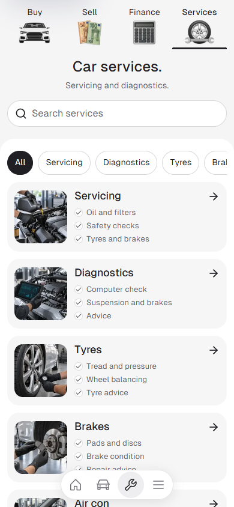
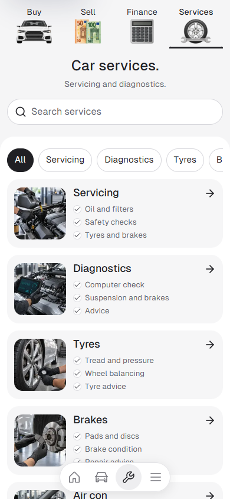
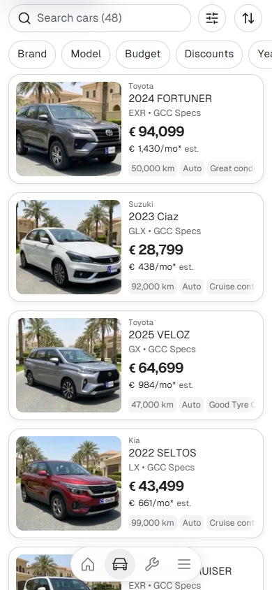

# Final mobile navigation and quick pills — 10 October 2026

Preview: `http://127.0.0.1:6506`. Canonical source: `L:/CODEX/cars/templates/app`, Cars `main`. Node 22.20.0; existing Next.js 16.3.8 webpack preview and installed dependencies reused.

Sell uses the image-generated straight euro-note artwork, with upright sides and aligned flat lower edges. The other three artwork files remain unchanged. All four illustrations share the same 64 × 42px mobile frame and visible bottom baseline through individual source view boxes. The previous Sell scaling workaround is removed. Tab heights, labels, selected underline and compact-on-scroll behavior remain intact.

Cars and Services quick pill labels use regular 15px type on mobile, up from 14px. Painted pill sizes, 44px hit targets and wider-screen typography remain unchanged. The existing compact dock's icon family, layout and 44px links are retained and checked.

## Matched 390px comparison

| Before | After |
| --- | --- |
|  |  |
|  |  |

Exactly four captures are retained: two matched route pairs covering the header, underline, dock and both pill consumers. Compact geometry and interaction results are retained alongside them. The generated original and one web derivative are source artwork, not QA intermediates.

## Focused validation

ESLint for the three changed code files and TypeScript without emit passed on Node 22.20.0. Browser checks cover 320px Buy/Sell/Finance/Services and Bulgarian Services; 390px Cars/Services; common artwork frame baseline; service category filtering/reset; compact header on scroll; Sell navigation; Cars dock navigation; Brand drawer and Escape dismissal; 44px dock links; no document overflow or browser errors. Wider 768px/1440px checks confirm the mobile SVG artwork is hidden and previous image paths retained. The existing root HTML produces Next's advisory about declaring smooth scroll behavior during route transitions; the exact warning is retained in the browser result.

See `verification.json`, `after-checks.json` and `before-checks.json`. Source commit/push is separate from deployment and dealer release selection; this task does not change the approved template lock.
