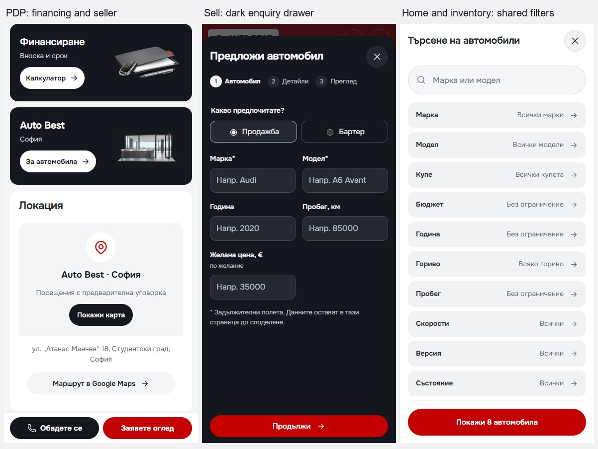

> Visual replacements from this pass were rejected. See [VISUAL-RESTORATION.md](VISUAL-RESTORATION.md) for the recovered homepage. Earlier screenshots and the isolated build do not describe the restored state.

# Final automated QA results

Generated: 2026-09-12T02:35:21.695597+00:00

Main dev URL: `http://127.0.0.1:6461`. Automated production checks: `http://127.0.0.1:6462`.
The isolated built copy matches every source file and relevant build/package configuration; see `source-verification.json`.

## Gates

| Check | Result |
| --- | --- |
| Architecture / assets / domain | Passed in `production-build.log` |
| Svelte and TypeScript | 0 errors, 0 warnings; fail-on-warnings enabled |
| Production build | Passed; isolated from the live dev server |
| Dependency audit | 0 reported vulnerabilities; `dependency-audit-current.json` |
| Chromium: mobile-resilience | Passed |
| Chromium: mobile-quality | Passed |
| Chromium: sveltekit-smoke | Passed |
| Chromium: enquiry-smoke | Passed |
| Chromium: mobile-filter-smoke | Passed |
| Chromium: desktop-discovery-smoke | Passed |
| Chromium: home-hierarchy-smoke | Passed |
| Chromium: mobile-render-check | Passed |
| Chromium: capture-mobile-changes | Passed |
| WebKit: mobile-resilience | Passed |
| WebKit: mobile-quality | Passed |

## Route, state and visual coverage

The existing route/journey suites exercise all eight vehicle detail records, all nine articles, core routes, enquiry topics, filtered return destinations, no-results and invalid IDs/404s. The new screenshot pass adds 70 route/viewport combinations at 320, 390, 430, 767, 768, 992 and 1440 CSS pixels.
Five additional active-state captures cover PDP panels, the calculator, Sell and Import drawers, and shared search. Screenshot success is not a substitute for design approval.

`mobile-quality-chromium`: 43/43 checks passed; run 2026-09-12T02:28:35.447Z.
`mobile-resilience-chromium`: 7/7 checks passed; run 2026-09-12T02:27:16.528Z.
`mobile-quality-webkit`: 43/43 checks passed; run 2026-09-12T02:29:02.908Z.
`mobile-resilience-webkit`: 7/7 checks passed; run 2026-09-12T02:27:34.480Z.

The quality suite includes route and open-modal accessibility, nested focus/scroll, whitespace/year validation, finance context and cold-image budgets. The resilience suite covers finance return/edit, blocked stock images including pre-hydration failures, short viewports, clipboard denial/share cancellation, and actual production CSP/noindex behavior.

## Cold-image payload

| Browser | Pixel density | Initial image bodies | Full-scroll image bodies |
| --- | --- | ---: | ---: |
| chromium | 1 | 490,373 bytes | 767,770 bytes |
| chromium | 2 | 689,991 bytes | 1,099,566 bytes |
| webkit | 1 | 391,474 bytes | 752,650 bytes |
| webkit | 2 | 560,968 bytes | 1,054,322 bytes |

All initial captures are below the 1.5 MB image budget. The original local audit recorded about 12.2 MB of initial image transfer. The old transfer metric includes response overhead while these new measurements count response bodies; use this as a payload comparison, not a field-performance or speed score.

## Text growth and constrained network

Six route families passed a 200% computed-font-size stress test without document-wide horizontal overflow. The test is not native OS text sizing. Fixed mobile actions were additionally changed to grow with wrapped labels and reserve their measured height.

Local production synthetic run: Cold-cache local production at 1.6 Mbps / 150 ms; no CPU throttle; observed LCP 2508 ms, CLS 0.00067. This is one laboratory run, not field Core Web Vitals or an INP result.

## Reproduction

Use the template-pinned Node 22 runtime. Set `BASE_URL` to the confirmed preview before browser suites. Standard `npm run quality` includes validation, existing smoke suites, mobile quality and resilience. Do not build into the live dev server's generated output concurrently; use the isolated staging workflow recorded by `prepare-production.py`.

```powershell
$env:BASE_URL='http://127.0.0.1:6462'
$env:PRODUCTION_ASSERTIONS='1'
npm run smoke
npm run check:mobile
npm run check:resilience
$env:PLAYWRIGHT_ENGINE='webkit'
npm run check:mobile
npm run check:resilience
```

## Explicit limitations

Physical iPhone/Android keyboard, upload picker and native share-sheet delivery, VoiceOver/TalkBack, and final human content/artwork approval remain unverified. WebKit automation is not a physical Safari session. Clipboard/sharing rejection and cancellation tests use controlled browser stubs; no customer enquiry was sent.
Automated accessibility excludes third-party iframe contents and retains incomplete/manual-review rules in its JSON. No claim of universal WCAG compliance is made. The built preview is local, not a public production deployment. Sample-stock/noindex guards remain enabled.

Earlier failed exploratory logs are retained for diagnosis. The authoritative completed suite results are `production-tests.json` and `webkit-tests.json`, with the corresponding final logs and artifact report timestamps.

## Screenshots



[PDP first screen](screenshots/pdp-first-screen.png) · [Financing panels](screenshots/pdp-banners-390.png) · [Dark Sell drawer](screenshots/sell-drawer-390.png) · [Import drawer](screenshots/import-drawer-390.png) · [Full homepage](screenshots/home-390.png)
