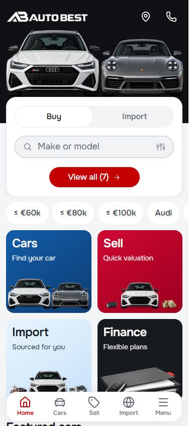
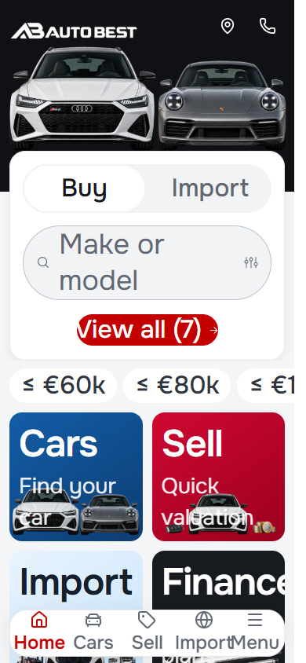
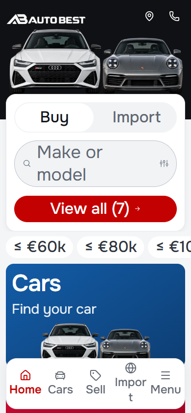

# Mobile audit and polish — 29 September 2026

Scope: the Auto Best reusable master, starting at `2cb6e6e6e` on Cars `main`, with the owner's existing homepage, catalog and finance edits present. Those pre-existing changes remain separate from this task's commit. No dealer release or deployment is included.

## Findings and changes

| Verified issue | Resolution |
| --- | --- |
| At 200% text, service descriptions overlapped artwork and the Finance title clipped. | Cards use content flow, retain a clear gap above artwork, and reflow to one column when enlarged text needs it. Artwork is constrained by both its aspect ratio and the available height. |
| Fixed-width entry actions and a fixed-height navigation bar could clip or collide with enlarged labels. | Entry action width scales in rem, text can wrap, and navigation height/clearance can grow. Standard controls retain their 44px touch target. |
| Footer-obscured navigation was transparent but still keyboard-focusable. | Hidden navigation is inert and has hidden visibility. Opening/closing the menu still restores focus. |
| Reduced-motion preference left page scrolling animated. | A shared reduced-motion rule also covers scroll and transition/animation duration. |
| Mobile layouts reserved a desktop scrollbar gutter, costing 15px in headless Chromium. | Mobile uses its available width; desktop retains its stable gutter. Scroll padding reserves clearance for the fixed actions. |
| Hidden service art downloaded eagerly and four below-fold vehicle photos claimed high priority. | The homepage does not render the mobile artwork inside its desktop banners. Decorative regions default to lazy loading; mobile hero art is explicitly prioritized; featured photos use their existing lazy policy. Desktop-only article art uses a media-qualified picture source. |

Three hidden homepage requests were eliminated: `service-car-v1.webp`, `menu-import-v2.webp`, and `menu-leasing-v2.webp`, totaling 605,268 transferred bytes in the initial baseline (about 591 KiB). This is a request-level improvement, not a claim about real-world LCP or a Lighthouse score. Dev and production font/logo compression differ, so their total transferred bytes are not directly comparable.

Onest remains self-hosted with Unicode subsets and `font-display: swap`. The pass preserves the established font scale, dealer logo variants, imagery and normal-size composition.

## Verification

Node 22.23.3, retained lockfile. Production browser checks use `http://127.0.0.1:5183`; the user's development URL is `http://127.0.0.1:5173/en/`.

- `npm run validate`: architecture, CSS policy, token graph, typography, assets, domain, localization, Svelte/TypeScript and production build. Svelte reported zero errors and zero warnings.
- `node scripts/mobile-final-smoke.mjs`: EN/BG at 320/390/430px, 200% text, actual artwork bounds, navigation targets, reduced motion, hidden dock focus, menu focus return and image request/priority contracts.
- `node scripts/mobile-polish-smoke.mjs`: EN/BG at 320/390/430/1440px, home/menu, inventory, filters, detail controls, short editors and settings.
- WebKit `overlay-controls-smoke.mjs`, cases `mobile-menu` and `import-form`: all 18 cases passed in EN/BG at the applicable 320/390/430/768/1440px widths.
- `route-smoke.mjs`: all 102 route/status/image/runtime/responsive cases passed, including EN/BG detail/article URLs, invalid URLs, zero results, 320px and short landscape.
- `enquiry-smoke.mjs`: sell/import validation, photos, review, share/copy, drafts and focus passed at 320/390/844/1440px, without server submissions. `mobile-filter-smoke.mjs`: all four viewport cases passed, including nested choices, draft cancellation and URL application.
- Axe-core: WCAG 2 A/AA, 2.1 AA and 2.2 AA rules across home, stock, vehicle detail, sell, import, finance, contact, about, guides and article at 320/390/430px in English. Final production scan: 30 cases, zero violations, zero runtime errors or page overflow. Form controls were at least 16px and no visible controls fell below 24px on either axis.

Initial development-server checks encountered module-fetch errors and a stalled desktop capture. Those runs are not acceptance evidence; final production checks supersede them. The stopped development listener was restored using the repository's preview helper and Node 22.

The broad suites preceded two final bounded corrections: constraining actual artwork height at 200% text and removing dormant mobile image nodes from the homepage banners. Repeated focused checks cover these final corrections. A repeat run exposed that lazy loading alone was not a deterministic guarantee against hidden image requests; the source omission resolves that cause rather than weakening the test.

## Evidence and limits

The retained before/after images use 390×844, loaded fonts, the same page position and returning English locale. `before-large-text.png` and `after-large-text.png` use a 200% root font size to exercise text resizing independently of viewport zoom.

| Before | After |
| --- | --- |
|  |  |
|  |  |

Automated scans do not establish complete WCAG conformance. Physical iOS/Android keyboard, screen-reader, safe-area and slow-network field tests remain unverified. The original wagon PNG is still about 1.15 MB and the raster-backed logo is relatively large; source-preserving responsive derivatives are a remaining media optimization opportunity. Existing business/demo data and enquiry delivery behavior are unchanged.

References: [WCAG 2.2](https://www.w3.org/TR/WCAG22/), [font loading](https://web.dev/articles/font-best-practices), [LCP resource priorities](https://web.dev/articles/optimize-lcp).
