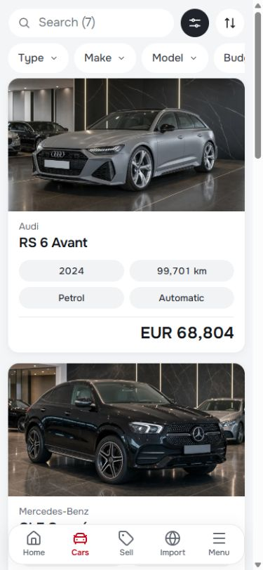
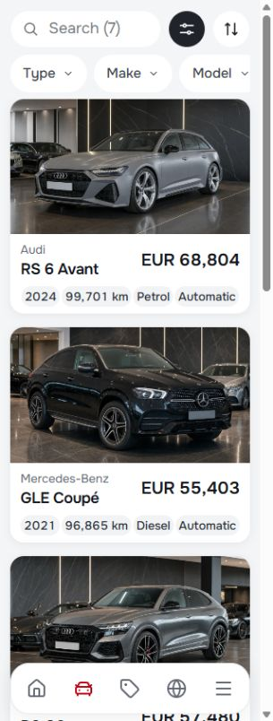
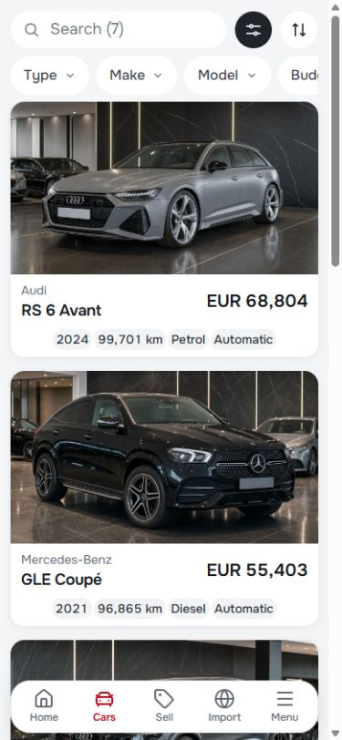
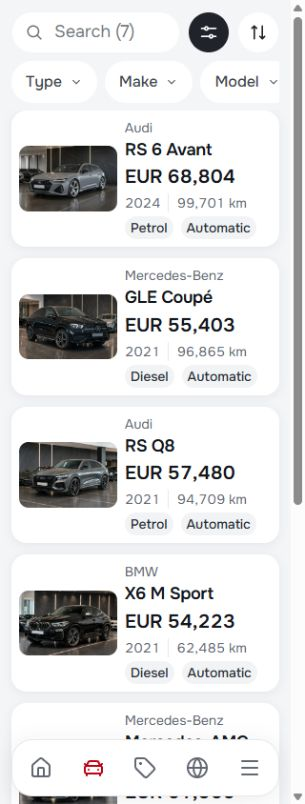
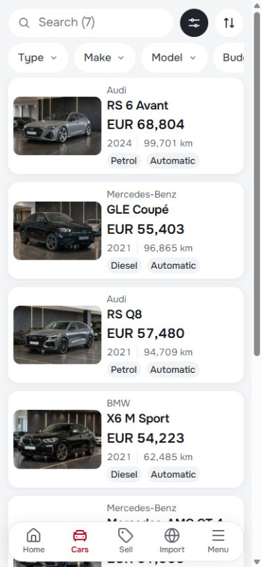

# Mobile inventory revision — 30 September 2026

The original split layout cropped away much of each car and squeezed the model names into a narrow column. The first revision, `e9d021f8c`, replaced it with a full-width landscape photograph above the vehicle information. The comparisons below record that first revision at **normal text size**, the same 320×844 and 390×844 viewports, and the same scroll position in the in-app browser at `http://127.0.0.1:5173/en/listing-grid`. Subsequent revisions and the current compact list appear at the end of this record.

| Normal text size | Before | After |
| --- | --- | --- |
| 320px |  |  |
| 390px |  |  |

## Implementation

- Mobile listing cards use a 16:9 image frame, 16px content padding and 16px separation between cards. Model names wrap completely. The make, specifications and price share a consistent left edge; specifications use restrained dividers rather than four separate chips. The 24px price uses the control line-height role so currency and amount can wrap comfortably at enlarged text sizes.
- The bottom dock shows icons when its available content width is at most 20rem, including normal 320px layouts and enlarged text on typical phones. The clipped label remains the accessible name. Wider normal-text layouts retain labels. All five controls retain at least 44×44px targets, current-page indication, keyboard focus and menu focus return.
- The mobile image `sizes` hint now matches the full-width frame. Only the first inventory image requests high fetch priority; subsequent images use browser lazy loading. Five 960px derivatives bridge the existing 640px and 1600px sources. A personalized photograph without a registered derivative still uses its own original.

The original desktop/tablet composition, inventory records, link destinations and source photographs remain in use. The mobile image frame trims background above/below the car instead of cropping its sides into a narrow thumbnail.

At enlarged desktop text sizes, the header's two action buttons can stack within their existing column so they do not cover the navigation links. Normal desktop text keeps the existing row.

## Responsive image delivery

The new files are faithful 960×640px resizes of the retained photographs, encoded with Sharp/libvips at WebP quality 82, effort 6. Their combined size is 293,068 bytes, versus 1,098,162 bytes for the five originals (73% smaller). This is an asset-size comparison, not a page-load-time measurement. A 390px viewport at 2× pixel density selects the new 960px source.

| Photograph | Original bytes | 960px bytes |
| --- | ---: | ---: |
| Stock 01 | 278,312 | 68,160 |
| Stock 02 | 248,390 | 65,538 |
| Stock 03 | 181,070 | 55,378 |
| Stock 04 | 182,452 | 46,414 |
| Stock 06 | 207,938 | 57,578 |

## Verification

The owned production preview at `http://127.0.0.1:5185` served the final build. The live in-app browser supplied the comparisons above and verified inventory → vehicle 1 → inventory `#vehicle-1` at 320px.

| Check | Result |
| --- | --- |
| `npm run validate` | Passed architecture, CSS, token, typography, asset, domain, locale, Svelte/type and build checks |
| Final CSS/Svelte checks and production rebuild | Passed; 0 Svelte errors and 0 warnings, Node 22.20.0 |
| `scripts/mobile-polish-smoke.mjs` | 8/8 passed: EN/BG at 320, 390, 430 and 1440px; full card titles, landscape frames, accessible icon names, first-image priority and existing actions |
| `scripts/mobile-final-smoke.mjs` | 6/6 passed: enlarged dock, reduced motion, menu focus return, hidden dock inertness and image loading |
| `scripts/mobile-reflow-smoke.mjs` | 66/66 Chromium and 66/66 WebKit cases passed, including text spacing, 200% root text and short dialogs |
| axe-core 4.13.0 and card text bounds | 42/42 inventory states passed with zero violations, overflow or clipped mobile copy; EN/BG, 320/360/390/430/767/768/1440px, normal/spacing/enlarged text |

The axe run includes `wcag2a`, `wcag2aa`, `wcag21a`, `wcag21aa` and `wcag22aa`. A 390px viewport at 2× density selected the 960px image. Detailed states are in [audit-report.json](audit-report.json); suite counts, timestamps and verified source blob IDs are in [checks.json](checks.json). Those blob IDs are checked against the scoped staged source before committing.

Initial concurrent runs encountered two navigation timeouts and a WebKit geometry sample before paint had settled. Final runs used two browser processes at most; the reflow harness now waits for paint after fonts are ready, consistent with its existing text-override sampling. The closer text bounds check also identified the price line-height and enlarged desktop action overlap addressed above. All final runs passed.

320 CSS pixels also represents a 1280px viewport at 400% zoom; its relevance extends beyond the physical width of a phone. See [W3C's reflow explanation](https://www.w3.org/WAI/WCAG22/Understanding/reflow.html).

## Scope and preserved work

### Badge follow-up

The badge revision, `de074faf1`, kept the photograph on top and grouped all four specifications into centered pill badges in two equal columns. At card widths of 15rem or less it used one badge column. Content had 12px vertical padding and a separate right-aligned price row. This layout was superseded by the compact revision below; [Styling](../STYLING.md#mobile-listing-cards) describes the current component contract.

The initial screenshots and full matrix above record the first revision, `e9d021f8c`. These are the updated cards at normal text size and the same scroll position:

| Width | Previous details | Centered badges |
| --- | --- | --- |
| 320px |  |  |
| 390px |  |  |

The badge revision passed `npm run validate` (0 Svelte errors and warnings), all 8 mobile polish cases, all 66 WebKit reflow cases, and all 42 Chromium inventory accessibility/text-bounds states with no violations or clipping. The tested `VehicleCard.svelte` blob is `e846e371bd1edcc9bc833507fbf1c0b455915bef`; the prior JSON matrices remain evidence for the first revision. Both languages were also inspected in the live in-app browser.

### Compact details follow-up

The separate price row and full-width badge grid made the cards unnecessarily tall. The model and price now share a row, with 18px and 20px type respectively. Specifications use small intrinsic-width badges in year/mileage and fuel/transmission pairs, wrapping as pairs when space is limited. The details panel uses 8px vertical and 12px horizontal padding, an 8px row gap and 2px gaps between badges. At narrow container widths or enlarged text, the identity and price stack without clipping. The full-width 16:9 photograph stays in place.

These screenshots compare the tall badge revision with the compact revision at **normal 16px root text**, identical CSS viewport sizes, and scroll position 0. In the in-app browser, the first card measures 251.5px high at 320px and 290.9px at 390px; its details panel is 93.4px in both views. Longer model names and translated badges grow naturally.

| Width | Tall badge revision | Compact details |
| --- | --- | --- |
| 320px |  |  |
| 390px |  |  |

The compact revision passed `npm run validate` (0 Svelte errors and warnings), all 8 mobile polish cases, all 66 WebKit reflow cases, and all 42 Chromium inventory accessibility/text-bounds states with no violations, overflow or clipped copy. These checks ran on the final production build at `http://127.0.0.1:5185`, using Node 22.20.0. The tested `VehicleCard.svelte` blob is `86e06b202903b9014852cd40624854cee66539c7`; earlier JSON matrices remain evidence for their respective revisions. Both languages were visually checked at 320px, and long titles at 390px. The detached development server runs at `http://127.0.0.1:5173`.

### Compact list follow-up

The current mobile inventory uses a landscape thumbnail beside a single details column. Price follows the model in both the markup and mobile layout. Year/mileage form a quiet text row; fuel/transmission use two badges with more internal space and separation. The photograph retains its source proportions so the vehicle stays visible. Narrow containers and enlarged text stack the photo above the information, while normal desktop and carousel composition remain intact. [Styling](../STYLING.md#mobile-listing-cards) owns the current contract.

At normal 16px root text, the first card is 143.4px high in both in-app browser views, compared with 251.5px at 320px and 290.9px at 390px in the previous revision. Four complete cards fit in each viewport. These comparisons retain the same viewport and scroll position 0:

| Width | Previous photo-on-top card | Compact list |
| --- | --- | --- |
| 320px |  |  |
| 390px |  |  |

The final build passed `npm run validate` with 0 Svelte errors and warnings, all 8 mobile polish cases, all 42 Chromium inventory accessibility/text-bounds states, and all 66 WebKit reflow cases. No violations, overflow or clipped copy were found in those states. The checks ran against the production preview on port 5185 with Node 22.20.0. Both languages were visually checked at 320px; the live 390px list → vehicle 1 → anchored list return also passed. Desktop card prices remain below their specifications with exactly one price per card. The mobile image hint now matches the thumbnail; a 390px retina viewport selects the existing 640px source, with first-image priority and subsequent lazy loading retained.

Tested source blobs: `VehicleCard.svelte` — `9f43221a78816f731ffcd2cfb72eaed457dbcc28`; `ListingResults.svelte` — `c67e5482d798d68996f2704031dffcf22025be0b`; `mobile-polish-smoke.mjs` — `5843fe05cb44372e79db3ee8b23fc7d55fa9d0e9`. Earlier JSON matrices remain evidence for their respective revisions.

This changes the reusable Auto Best master. It does not promote a template release or deploy a dealer. The working preview includes the pre-existing body/brand artwork, locale and vehicle-finance drafts; these are preserved outside this commit. The shared Cars index also retains other tasks' staged changes. The first revision's asset guard covered its five image derivatives; the compact list introduces no new assets.

Automated axe and layout checks provide bounded evidence, not a claim of complete WCAG conformance. Physical-device and screen-reader acceptance remain separate from these browser checks.
